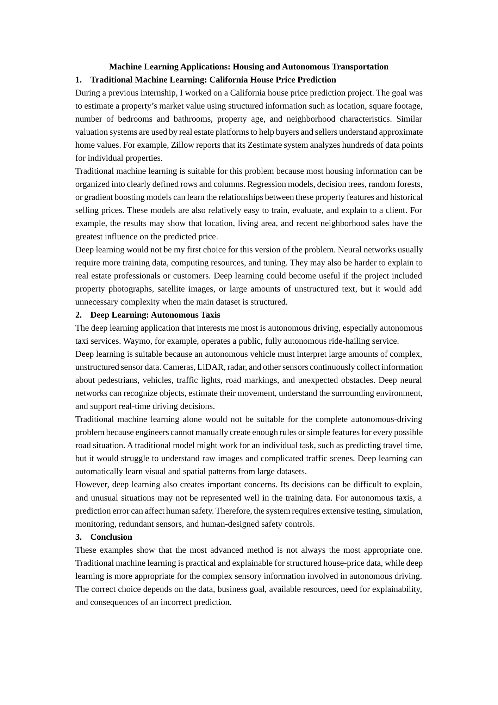

# Choosing the Right Machine Learning Approach

## A client-facing comparison of structured prediction and deep perception

Selecting a more complex model does not automatically create a better solution. This case study compares two real-world machine learning applications—California house-price prediction and autonomous taxi perception—to show how data type, explainability, operational risk, and resource requirements should drive model selection.

> **Decision principle:** Use the simplest approach that can learn the required signal, meet the business objective, and operate within the acceptable risk boundary.

## Executive Summary

| Business problem | Recommended approach | Why it fits | Why the alternative is weaker |
| --- | --- | --- | --- |
| Estimate house values from structured property and neighborhood data | Traditional supervised machine learning | Tabular features work well with regression and tree-based models; training, validation, and explanation are comparatively efficient | Deep neural networks add data, compute, tuning, and explainability costs without a clear advantage for a structured-data baseline |
| Interpret complex road scenes for an autonomous taxi | Deep learning within a larger safety system | Neural networks can learn visual and spatial representations from cameras, lidar, radar, and large-scale driving data | Traditional models depend heavily on engineered features and are insufficient for end-to-end interpretation of raw, high-dimensional sensor input |

## Case 1 — California House-Price Prediction

### Client problem

A real-estate team needs repeatable property-value estimates using information such as location, square footage, property age, bedrooms, bathrooms, and neighborhood conditions.

### Recommended approach

Traditional supervised regression is the appropriate starting point. Linear regression provides a transparent baseline, while random forests or gradient-boosted trees can capture nonlinear relationships and interactions without requiring an oversized training pipeline.

The standard scikit-learn California Housing dataset demonstrates the structure of this problem: numeric rows and columns, a continuous price target, 20,640 observations, and eight predictive features. This is a natural regression setting rather than a raw perception task.

### Why deep learning is not the first choice

- The core inputs are structured rather than images, audio, or free text.
- A neural network normally creates additional tuning and infrastructure cost.
- Model behavior may be harder to explain to agents, analysts, customers, and compliance stakeholders.
- A lower-complexity model establishes a stronger baseline and makes business tradeoffs easier to evaluate.

Deep learning could become valuable if the scope expanded to property photographs, satellite imagery, floor plans, or large volumes of listing text. That would be a different, multimodal problem.

### Client-ready evaluation plan

- Compare a linear baseline, random forest, and gradient-boosted regressor.
- Use a geographically and temporally appropriate validation design to reduce leakage.
- Report MAE and RMSE alongside error by price band and region.
- Review feature importance or SHAP explanations with domain experts.
- Monitor data drift and valuation error after deployment.

## Case 2 — Deep Learning for Autonomous Taxis

### Client problem

An autonomous ride-hailing system must detect road users, understand lanes and signals, estimate motion, and respond to changing traffic conditions using continuous sensor input.

### Recommended approach

Deep learning is suitable for perception and prediction because the input is high-dimensional and unstructured. Neural networks can learn useful representations from camera images and other sensor streams, support object detection and segmentation, and model complex spatial and temporal patterns.

Waymo describes its autonomous-driving hardware as a combination of lidar, cameras, radar, and an AI compute platform. Its software uses those inputs to localize the vehicle, understand the environment, predict what may happen next, and decide how to respond. This illustrates why the application requires more than a single conventional model.

### Why traditional machine learning alone is not suitable

- Engineers cannot manually define robust features for every object, lighting condition, road geometry, and unusual event.
- Conventional tabular models do not directly interpret raw images or dense sensor streams at the required level.
- The system must learn complex visual, spatial, and temporal relationships.
- Separate predictions must operate inside a real-time, safety-critical architecture.

Traditional machine learning can still support narrower components such as travel-time prediction, fleet demand forecasting, anomaly scoring, or maintenance planning. The comparison is therefore about the primary perception problem—not a claim that every part of an autonomous-taxi platform must use deep learning.

### Safety and delivery requirements

- Define an operational design domain and explicit system boundaries.
- Test common, rare, and adversarial scenarios in simulation and on-road programs.
- Use redundant sensing and independent safety controls.
- Measure performance by scenario and population, not only by aggregate accuracy.
- Maintain monitoring, incident review, and controlled model-release processes.

## What This Work Demonstrates

For potential clients, this project demonstrates my ability to:

- translate a business problem into a machine learning task;
- distinguish structured-data prediction from deep-learning perception;
- avoid unnecessary model complexity;
- explain technical tradeoffs to a nontechnical audience;
- connect model choice to cost, interpretability, deployment, and risk;
- communicate the limits of an analysis rather than overstate results.

## Deliverables

- [Read the complete report (PDF)](docs/Machine%20Learning%20Applications%20-%20Zihuan%20Wang.pdf)
- [Download the editable report (DOCX)](docs/Machine%20Learning%20Applications%20-%20Zihuan%20Wang.docx)
- [View the expanded professional analysis](REPORT.md)

## Scope and Limitations

This repository is a model-selection case study, not a production implementation or performance benchmark. It does not include trained model artifacts, proprietary internship data, autonomous-driving code, or claims that one algorithm is universally superior. A real engagement would require stakeholder discovery, data auditing, experimental baselines, validation, risk review, and deployment planning.

## Sources

- [scikit-learn: California Housing dataset](https://scikit-learn.org/stable/modules/generated/sklearn.datasets.fetch_california_housing.html)
- [Waymo: Frequently Asked Questions](https://waymo.com/faq/)
- [Waymo: Autonomous Driving Technology](https://waymo.com/about/)

## Author

Zihuan Wang

## Rights

Copyright © 2026 Zihuan Wang. Shared for portfolio and educational viewing.
